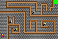

# Maze Runner

Authors: Kishan Patel and Tejas Srivatsav

Design: The objective of the game is for the player to reach the other end of the maze. Unfortunately the maze is dark, so you will need to strategically use the flashlights along the way to temporarily illuminate the entire map.

Screen Shot:

How Your Asset Pipeline Works:

All of the assets (background, walls, player, and flashlights) were drawn using GIMP. Then we exported and saved these files in PNG format. In export_assets.cpp, these PNG files are then used to create palettes and tiles, which are then saved in binary format. The palettes are created based on the four colors in each sprite, and then these palettes are used to create tiles. Finally, the information in the binary file is used to fill in the palette table and tile table.

How To Play:

Use the arrow keys to move the player. If you move over the flashlights, you will be able to view the entire map.

Sources:
The following two sources served as inspiration for the way in which we created palettes and tiles from the PNG files.

https://github.com/kjannakh/15-466-f20-base1/blob/master/process_assets.cpp
https://github.com/Chipxiang/Jump-Guy/blob/master/asset_converter.cpp

This game was built with [NEST](NEST.md).

